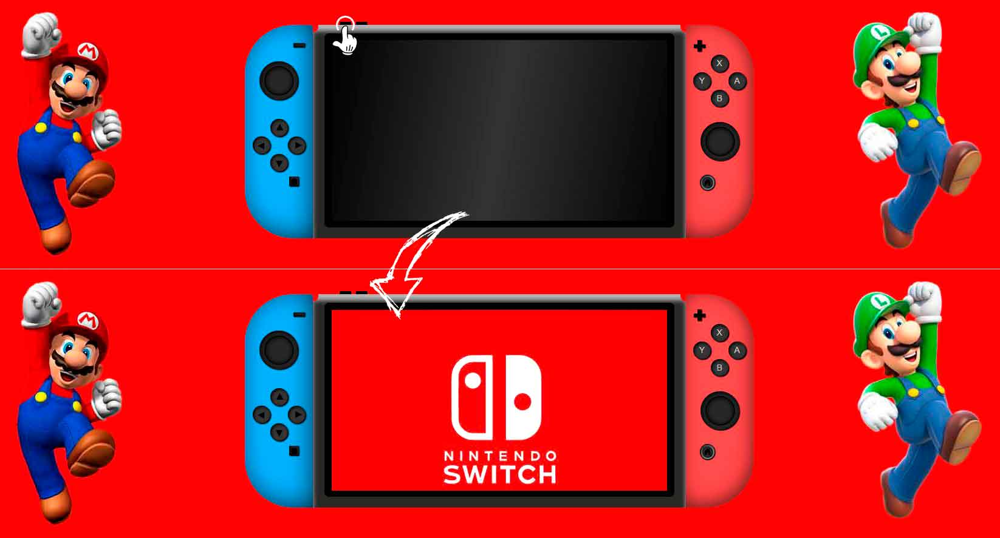
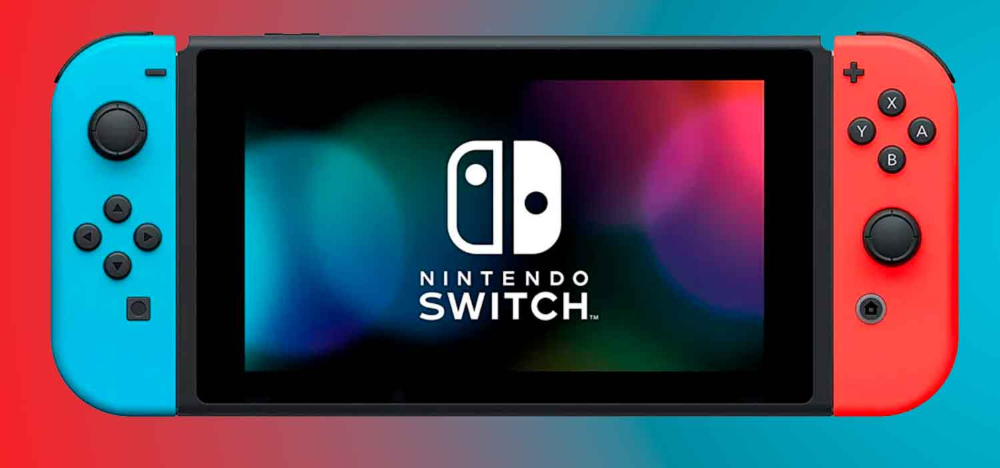

# Videoconsola Nintendo Switch

**Proyecto 1** - Videoconsola con HTML, CSS Y JS.

Esta videoconsola ha sido desarrollada por Hétor Mateu, como primer proyecto del Bootcamp de Full Stack Developer de Geekshubs Academy.

## Tabla de contenidos
* [💻 Tecnologías utilizadas](#tecnologías-utilizadas)
* [🕹️ Cómo funciona](#cómo-funciona)
* [💡 Referencias](#referencias)
* [:pick: Desarrollo](#desarrollo)
* [📃 Licencia y Copyright](#licencia-y-copyright)

### Tecnologías utilizadas
  
 

También se ha utilizado, para mejorar el resultado final: **Adobe Photoshop**.

### Cómo funciona
Esta réplica de la videoconsola Nintendo Switch, es capaz de realizar un par de interacciones con el usuario.
* **Encender / Apagar** la videoconsola:
  * Para encender la videoconsola, basta con que pulses el botón de encendido que se sitúa en la parte superior de la misma. Una vez encendida, si lo vuelves a pulsar, se apagará.
  >

* El **cursor** cambia cada vez que se sitúa sobre algún botón.
* Todos **los botones** cambian de aspecto al pulsarlos.

### Referencias
Para la realización de este proyecto, me he basado en la videoconsola **Nintendo Switch**. Fue lanzada al mercado el **20 de septiembre del 2019** y rápidamente se convirtió en la consola de sobremesa que más rápido se ha vendido en la historia de la propia compañía.
>

### Desarrollo

### Licencia y Copyright
El material multimedia utilizado para la realización de este proyecto, es propiedad de ***Nintendo Co., Ltd***.